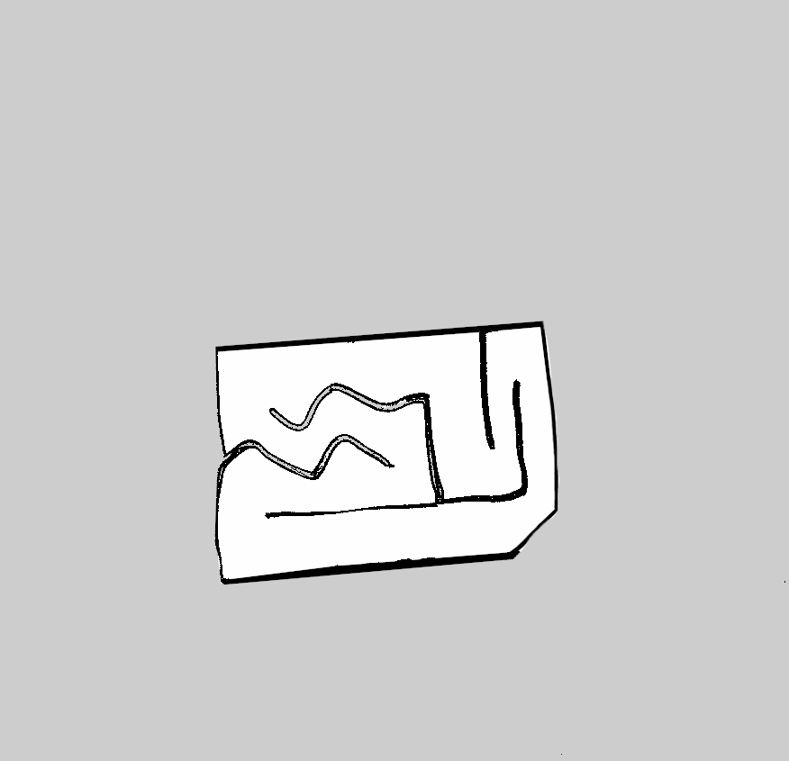
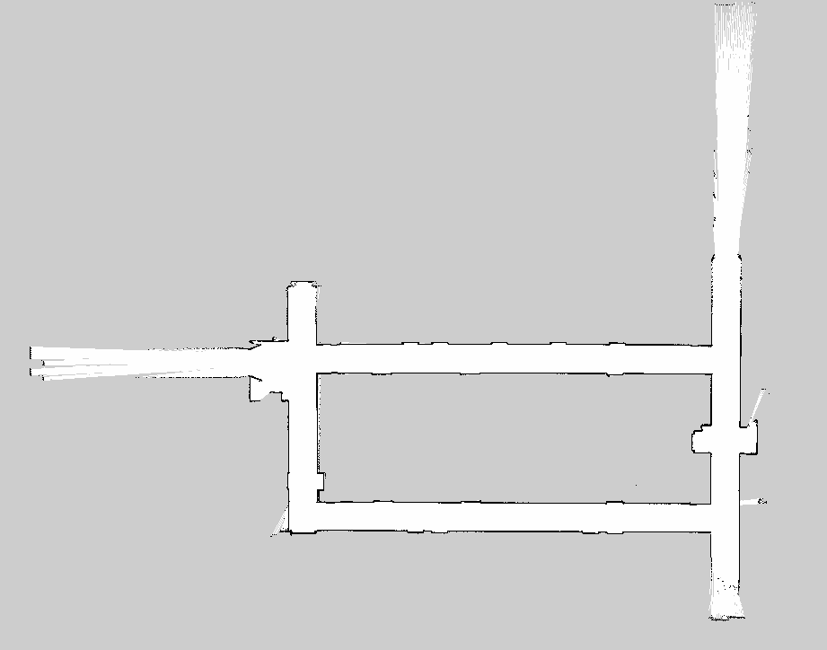

# Real-Time Autonomous Racing With MPC 

This project is our end-to-end F1TENTH racing system that runs a kinematic Model Predictive Controller (MPC) in real time on ROS 2 hardware/software, with a LiDAR-based safety fallback when collision risk spikes.

The goal of this README is to explain what we built and how it works without requiring someone to clone or run the code.

[](https://youtu.be/lUgOXTFKQM0)

## System Summary

- Primary controller: finite-horizon kinematic MPC.
- Safety supervisor: iTTC (inverse time-to-collision) check from LiDAR.
- Fallback controller: Follow-the-Gap steering when iTTC is unsafe.
- Runtime node: mpc/scripts/mpc_node.py.

Control loop behavior:
1. Read odometry and LiDAR.
2. Build a reference trajectory from nearest waypoint.
3. Linearize model around predicted motion.
4. Solve QP with CVXPY + OSQP.
5. Publish Ackermann speed/steering.
6. Override with gap-follow steering when iTTC threshold is violated.

## Sensing, Localization, and SLAM Stack

This project is not only control. The runtime controller is fed by sensing and localization streams and runs on top of map products generated from SLAM/mapping workflows.

### Sensor and state interfaces (direct code)

From mpc/scripts/mpc_node.py:

```python
# Create subscribers and publishers
self.create_subscription(Odometry, '/ego_racecar/odom', self.pose_callback, 10) # On sim
# self.create_subscription(Odometry, '/pf/pose/odom', self.pose_callback, 10) # On Car
self.create_subscription(LaserScan, '/scan', self.scan_callback, 10) # On Car
self.drive_publisher = self.create_publisher(AckermannDriveStamped, 'drive',10)
```

This shows the full sensing-control loop wiring:
- Odometry feeds localization/state estimate for MPC.
- LiDAR feeds collision-risk estimation and reactive fallback.
- Ackermann commands are published from the same node.

### Odometry -> MPC state estimation (direct code)

```python
vehicle_state = State()
vehicle_quaternion = pose_msg.pose.pose.orientation
vehicle_state.x = np.float64(pose_msg.pose.pose.position.x)
vehicle_state.y = np.float64(pose_msg.pose.pose.position.y)

vehicle_state.yaw = np.float64(self.get_yaw_from_quaternion(vehicle_quaternion))
norm_speed = np.linalg.norm(np.array([pose_msg.twist.twist.linear.x, pose_msg.twist.twist.linear.y]))
vehicle_state.v = norm_speed
vehicle_state.v = max(norm_speed, 1.5)

self.current_x_vel = pose_msg.twist.twist.linear.x
```

Quaternion-to-yaw conversion used in localization state extraction:

```python
def get_yaw_from_quaternion(self, orientation):
   """ Convert quaternion to yaw angle """
   import tf_transformations
   quaternion = [orientation.x, orientation.y, orientation.z, orientation.w]
   euler = tf_transformations.euler_from_quaternion(quaternion)
   return euler[2]
```

### LiDAR sensing -> iTTC safety metric (direct code)

```python
angle_min = scan_msg.angle_min
angle_max = scan_msg.angle_max
range_min = scan_msg.angle_min
range_max = scan_msg.range_max
increment = scan_msg.angle_increment
r = np.array(scan_msg.ranges) # Gather the range measurements

angles = angle_min + np.arange(len(r)) * increment

angle_mask = (angles >= self.scan_angle_min) & (angles <= self.scan_angle_max)
inside_range_data = r[angle_mask]
inside_angles = angles[angle_mask]

good_idx = np.isfinite(inside_range_data) & (inside_range_data > range_min) & (inside_range_data < range_max)
r = inside_range_data[good_idx]
angle = inside_angles[good_idx]

r_dot = self.current_x_vel * np.cos(angle) # Calculate r dot
r_dot = np.maximum(1*r_dot, 0) # Take only shrinking values or 0
r_dot[r_dot==-0.0] = 0.0

self.iTTC = r/r_dot
```

Safety threshold and scan sector configuration used at runtime:

```python
self.iTTC = np.array([np.inf])
self.safe_stop_threshold = 0.5 #s
self.scan_angle_min = -np.pi/4 # -45 degrees
self.scan_angle_max = np.pi/4 # 45 degrees
```

### Localization + mapping context for this project

The controller is map-aware through prebuilt occupancy grids and corresponding waypoint trajectories. This repository includes multiple map products used during development and race prep:

- maps/final_race_pennovation_closed.yaml + maps/final_race_pennovation_closed.png
- maps/final_race2.yaml + maps/final_race2.png
- maps/levine_2nd.yaml + maps/levine_2nd.png
- maps/map_edited.yaml + maps/map_edited.pgm

In-code comment evidence that SLAM-remapped tracks were part of the workflow:

```python
# Levine2nd_Neel_1300 for Levine's Clean Sim Map.
# waypoints_new_new for our remapped Levine SLAM Map.
# csv_wrap_2pi = 0, since our csv is pi to -pi
```

This is the practical stack: map/SLAM outputs provide the environment frame, odometry provides live ego state, LiDAR provides online obstacle/safety observability, and MPC generates trajectory-following control in real time.

## MPC Theory (What We Implemented)

### Vehicle model

We use a kinematic bicycle model with state and input:

$$
x_k = [x, y, v, \psi]^T, \quad u_k = [a, \delta]^T
$$

Continuous-time equations:

$$
\dot{x}=v\cos(\psi), \quad
\dot{y}=v\sin(\psi), \quad
\dot{v}=a, \quad
\dot{\psi}=\frac{v\tan(\delta)}{L}
$$

After discretization and local linearization around an operating point:

$$
x_{k+1}=A_k x_k + B_k u_k + C_k
$$

### Objective

At each cycle, we solve a finite-horizon quadratic program:

$$
\min_{x,u}
\sum_{k=0}^{T-1}\|x_k - x_k^{ref}\|_Q^2
+\|x_T - x_T^{ref}\|_{Q_f}^2
+\sum_{k=0}^{T-1}\|u_k\|_R^2
+\sum_{k=0}^{T-2}\|u_{k+1}-u_k\|_{R_d}^2
$$

### Constraints

$$
x_{k+1}=A_kx_k+B_ku_k+C_k, \quad x_0=x_{measured}
$$

$$
\delta_{min}\le\delta_k\le\delta_{max},
\quad |\delta_{k+1}-\delta_k|\le\dot{\delta}_{max}\,dt
$$

$$
v_{min}\le v_k\le v_{max},
\quad a_k\le a_{max}
$$

This is solved online with OSQP every control cycle.

## Direct Code Evidence (How Theory Became Running Software)

All of the following is implemented in mpc/scripts/mpc_node.py.

### 1. MPC objective terms in code

```python
objective = cvxpy.quad_form(cvxpy.vec(self.uk), R_block)
reference_trajectory_diff = cvxpy.vec(self.xk - self.ref_traj_k)
objective += cvxpy.quad_form(reference_trajectory_diff, Q_block)
objective += cvxpy.quad_form(self.xk[:, -1] - self.ref_traj_k[:, -1], self.config.Qfk)
control_input_diff = cvxpy.vec(self.uk[:, 1:] - self.uk[:, :-1])
objective += cvxpy.quad_form(control_input_diff, Rd_block)
```

### 2. MPC constraints in code

```python
constraints.append(
      cvxpy.vec(self.xk[:, 1:])
      == self.Ak_ @ cvxpy.vec(self.xk[:, :-1]) + self.Bk_ @ cvxpy.vec(self.uk) + self.Ck_
)
constraints.append(self.uk[1, :] >= self.config.MIN_STEER)
constraints.append(self.uk[1, :] <= self.config.MAX_STEER)
constraints.append(self.uk[1, 1:] - self.uk[1, :-1] <= self.config.MAX_DSTEER * self.config.DTK)
constraints.append(self.uk[0, :] <= self.config.MAX_ACCEL)
constraints.append(self.xk[2, :] <= self.config.MAX_SPEED)
constraints.append(self.xk[2, :] >= self.config.MIN_SPEED)
constraints.append(self.xk[:, 0] == self.x0k)
```

### 3. Real-time solve and command publish

```python
self.MPC_prob.solve(solver=cvxpy.OSQP, verbose=False, warm_start=True)

steer_output = self.odelta_v[0]
speed_output = vehicle_state.v + self.oa[0] * self.config.DTK
```

### 4. Hardware safety switch (iTTC -> Follow-the-Gap)

```python
self.iTTC = r / r_dot
iTTC_stop_bool = self.iTTC < self.safe_stop_threshold

if iTTC_stop_bool.any():
      drive_msg.drive.steering_angle = 1.0 * (self.gap_follow_angle - self.mpc_last_steering_angle) + self.mpc_last_steering_angle
      drive_msg.drive.speed = self.current_x_vel * 0.9
else:
      drive_msg.drive.steering_angle = steer_output
      drive_msg.drive.speed = speed_output
```

This is the key real-time behavior: MPC drives by default, but a collision-risk trigger can immediately switch steering authority to a reactive obstacle-avoidance policy.

## Maps We Built and Used

### Final race map (Pennovation)



- Metadata file: maps/final_race_pennovation_closed.yaml
- Resolution: 0.05 m/cell
- Origin: [-20, -12.6, 0]
- Typical waypoint variants used with this map:
   - waypoints/final_race_pennovation_closed.csv
   - waypoints/final_race_pennovation_yaw.csv
   - waypoints/final_race_pennovation_optimal_sim_mpc.csv

### Race2 map


- Metadata file: maps/final_race2.yaml
- Resolution: 0.05 m/cell
- Origin: [-5.97, -22.3, 0]
- Waypoint examples:
   - waypoints/zirui_race2_centerline_v_opt_yaw.csv
   - waypoints/final_race2_optimal_yaw.csv

### Levine map



- Metadata file: maps/levine_2nd.yaml
- Resolution: 0.05 m/cell
- Origin: [-16.7, -7.44, 0]
- Waypoint examples:
   - waypoints/Levine2nd_Neel_1300.csv
   - waypoints/Levine2nd_Selina.csv

## Waypoint Pipeline

Our controller expects waypoints in [x, y, yaw, velocity] format.

Pipeline scripts:
- helper_scripts/reformat_optimal_waypoints_for_mpc.py
   - Reformats optimizer-exported trajectories into MPC-ready CSV.
- helper_scripts/extract_yaw_from_xy_trajectory.py
   - Computes heading from consecutive XY points and appends speed.

In the node, waypoints are loaded and consumed as:

```python
waypoint_data = self.load_waypoints(waypoint_filepath)
self.waypoints = np.array(waypoint_data, dtype=np.float64)

ref_x = self.waypoints[:, 0]
ref_y = self.waypoints[:, 1]
ref_v = self.waypoints[:, 3]
ref_yaw = self.waypoints[:, 2]
```

## Real-Time Hardware Readiness Notes

- ROS 2 interfaces are wired for odometry, LiDAR, and Ackermann drive.
- MPC solve uses warm start to reduce per-cycle latency.
- Safety guardrail does not wait for global replanning; it reacts immediately from local LiDAR data.
- Trajectory and prediction markers are published for runtime introspection.

## Run Context

- Main runtime script: mpc/scripts/mpc_node.py
- Package manifest: mpc/package.xml
- Build file: mpc/CMakeLists.txt

Typical commands:
1. colcon build --packages-select mpc
2. source install/setup.bash
3. ros2 run mpc mpc_node.py

Note: waypoint_filepath is currently hardcoded in mpc/scripts/mpc_node.py and should be adjusted for each environment.

## Media

Simulation and on-car clips are listed in SUBMISSION.md.
